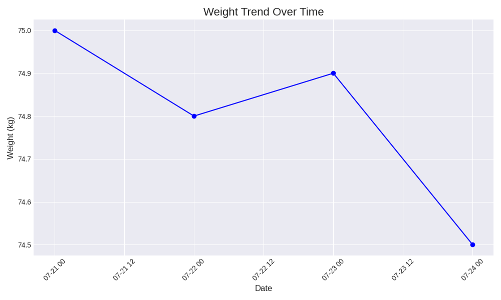

# My Growth OS v1.0 🌱

欢迎来到我的人生操作系统。这是一个开源项目，记录我的个人成长、挑战和思考。

---

## 🎯 当前挑战：21天健身计划

* **进度**： 
    * *小提示：上面的进度条可以用 `https://progress-bar.dev/[百分比]` 动态生成。比如第5天就是 `5/21 ≈ 23%`，所以是 `...dev/23/`*
* **详细日志**：[➡️ 点击查看挑战日志](./challenges/01_21-day-fitness/LOG.md)

---

## 💡 个人状态

* **身能 (SN)**: 1500 🔥
* **心能 (XN)**: 1200 🧠
* **成就墙**: 
    
    

---

## 📈 数据可视化

这是由 GitHub Actions 自动更新的最新数据。

### 体重变化趋势

---